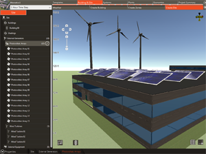

# gbXML News

## Webinar July 16, 2020: New Building Analysis Software Tools and Green Building XML (gbXML)

YouTube Video: https://www.youtube.com/watch?v=nKNquCcoBJg&feature=youtu.be

This is a 61 minute video of a webinar that targets energy modelers, engineers, architects, software vendors, and generally anyone who is interested in learning about Trane TRACE 3D Plus, Perkins and Will's new SPEED software tool, and gbXML.

## 1. Overview of gbXML by Stephen Roth ~ President Carmel Software and a Director of Green Building XML

Stephen presents an overview of a pre-release of the next generation of the [Ladybug Tools / Spider gbXML Viewer]( https://www.ladybug.tools/spider-2020/spider-gbxml-viewer/ ) as linked to https://gbxml.org/. ( Click the "Viewer" button at top right of the page).

### gbXML

* Overview: gbXML is the "language of buildings" ~ enables communication between many building design software tools.
* Full [XML schema]( https://en.wikipedia.org/wiki/XML_schema ) with over 500 types, elements and enumerations: [Schema GreenBuildingXML_Ver6.01.xsd]( https://gbxml.org/schema_doc/6.01/GreenBuildingXML_Ver6.01.html) 
* Comprehensive sustainable building analysis: energy, carbon, water, light, fire and costs
* Ownership and Support: www.gbxml.org and https://github.com.GreenBuildingXML

### ASHRAE Research Project ~ RP-1810 Development of reference BIM test cases for improving usage of software interoperability schemas

* Develop software test cases and validation for gbXML files
* https://www.ashrae.org/File%20Library/Technical%20Resources/Research/Links/RFP/1810-TRP.pdf
* https://myemail.constantcontact.com/News-from-Green-Building-XML--gbXML-.html?soid=1103133034893&aid=BqFMY_o9jCU

### Spider Viewer

* Open source viewer
* Current version: https://www.ladybug.tools/spider-gbxml-tools/spider-gbxml-viewer/
* Development version: https://www.ladybug.tools/spider-2020/spider-gbxml-viewer/

## 2. Presentation by Jim Spielbauer ~ Lead Engineer – Modeling and Simulation group at Trane Technologies

Jim presents an overview of the new [TRACE 3D Plus]( https://www.trane.com/commercial/north-america/us/en/products-systems/design-and-analysis-tools/analysis-tools/trace-3d-plus.html ) desktop software using gbXML. 

TRACE 3D Plus is a next generation building design and analysis software program that delivers faster, more accurate results through a seamless workflow that closely aligns with today's building process: https://www.trane.com/commercial/north-america/us/en/products-systems/design-and-analysis-tools/analysis-tools/trace-3d-plus.html

### TRACE 3D Plus

* Building design and analysis software
* Built on the globally recognized EnergyPlus calculation engine
* Comprehensive energy modeling and economic analysis
* Pre-configured building themes, libraries a pre-loaded and scalable templates
* Schematically configure systems in plants
* Import 3D models directly from CAD tools using Green Building XML (gbXML)

### Links of interest

Marketing literature provides a high level overview of features: https://www.trane.com/commercial/north-america/us/en/products-systems/design-and-analysis-tools/analysis-tools/trace-3d-plus.html

Customer support portal: https://tranecds.custhelp.com/app/home

eLearning Videos, there are two free ones, they are a bit old but still would provide overview of what people use TRACE 3D Plus for but is sort of for showing people how to use various features in the program: https://tranecds.custhelp.com/app/e_learning

Answers section of the website (https://tranecds.custhelp.com/app/answers/list) if you have questions the videos don’t cover.

You can download a free trial version from this webpage: https://www.trane.com/commercial/north-america/us/en/products-systems/design-and-analysis-tools/analysis-tools/trace-3d-plus.html Look on the right hand side under Additional Resources, there should be a link to download a trial version. 

gbXML Interoperability with TRACE 3D Plus and Autodesk® Revit: https://tranecds.custhelp.com/app/answers/detail/a_id/724/~/gbxml-interoperability-with-trace-3d-plus-and-autodesk%C2%AE-revit

### 3. Presentation by Ben Welle ~ Director of Energy Lab - Perkins and Will 

Ben presents a demo of the the new [SPEED (Simulation Platform for Energy Efficient Design)]( https://speed.perkinswill.com/ ) web- and cloud-based software tool using gbXML. 

SPEED is a web-based and cloud-based energy/daylighting/solar design and simulation platform for early design developed for architects enabling a 1-day turn-around from design question to a data-driven design answer.

Features

* web-based
* Cloud based 
* Energy analysis
* Solar radiation analysis
* Sunlight hour analysis
* Shadow/Sun path analysis
* Block and stack tool
* CAD integration
* Parametric design
* Statistical analysis
* Interactive results visualization
* Artificial intelligence
* Knowledge management/Reuse

Benefits

* Enables parametric design capabilities to designers with no experience
* Generate and run hundreds or thousands of design options leveraging statistical analysis
* Artificial intelligence built in to ensure best available assumptions and data integrity
* <24 hour turn around from design questions being asked tomorrow based results to help answer them
* Easily trainable (<1 hour) with meaningful and intuitive visualizations
* $$$ savings from having in house performance analysis capabilities, less rework, etc.
* More effective collaboration with consultants
* Risk mitigation for the rapidly approaching world of performance-based contracting

